  

<!--BANNER: Star Wars-style opening crawl, assets/crawl.svg-->

<h1 align="center">Hi there, I'm Islam Kuttybaev ⚔️</h1>

- 🎓 **4th year Data Science & Statistics** student @ [SDU University](https://sdu.edu.kz)
- 🤖 Building **ML pipelines**: NLP, time series, regression, explainability (SHAP)
- 🏫 **Teaching Assistant**, **PhD Research Assistant** and **Tutor** @ Azat Academia
- 📖 Currently learning: **Deep Learning & Transformers**
- 🛠️ Skills: **Python, SQL, Scikit-learn, Pandas, Power BI**
- 🌍 Languages: **Kazakh** (native) · **Russian** (C1) · **English** (B2)
- 💼 Open to **Data Science / ML internships** and research roles
- 📫 Reach me at: [islam0402@list.ru](mailto:islam0402@list.ru) · Telegram [@rule_46](https://t.me/rule_46)
- 📍 **Location:** Almaty, Kazakhstan 🇰🇿

 

#### **The Jedi way:**
> Your focus determines your reality. — *Qui-Gon Jinn*

#### **The data scientist's way:**
> The greatest teacher, failure is. Every wrong model is one step closer to the right one. — *after Master Yoda*

<!--TECH STACK-->
<h2 align="center">🛠️ Jedi Arsenal // tech stack</h2>

<b>Languages</b> 
  
  
  
  
  

<b>Machine Learning & AI</b> 
  
  
  
  
  
  
  

<b>Data & Visualization</b> 
  
  
  
  
  
  
  
  

<b>Databases</b> 
  
  
  
  

<b>Tools</b> 
  
  
  
  
  
  
  

<b>🧪 Methods & algorithms I've applied</b>

 

`Linear / Logistic Regression` · `Random Forest` · `Gradient Boosting` · `SVM` · `Naive Bayes` · `K-Means` · `DBSCAN` · `PCA` · `TF-IDF` · `ARIMA` · `Holt-Winters` · `Hypothesis Testing` · `ANOVA` · `Cross-Validation` · `Grid Search` · `SMOTE`

<!--PROJECTS-->
<h2 align="center">🚀 Missions Completed // projects</h2>

<table>
<tr>
<td width="50%" valign="top">

### 🎓 Student Performance Prediction
Classification model that predicts student performance from academic data.

- ✅ **84% accuracy**; SMOTE fixes class imbalance
- 🔍 SHAP for model explainability
- 📊 Insights visualised in Power BI

`Python` `Scikit-learn` `SHAP` `Power BI`

</td>
<td width="50%" valign="top">

### 🗣️ Kazakh–Russian Sentiment Analysis
Sentiment classification of Kazakh and Russian reviews.

- 📝 **2,000 reviews**
- ⚙️ TF-IDF + SVM, **F1 = 0.81**

`Python` `NLTK` `Scikit-learn` `TF-IDF`

</td>
</tr>
<tr>
<td width="50%" valign="top">

### 🛒 E-commerce Sales Analytics
Sales analysis of an online store, from SQL queries to business insights.

- 🗃️ **50K+ records** analysed with SQL
- 📈 Found a **17% seasonal sales spike**
- 📊 Power BI dashboard

`SQL` `Power BI` `Excel`

</td>
<td width="50%" valign="top">

### 🌡️ Almaty Weather Forecasting
Time-series forecasting of Almaty temperatures.

- 📉 ARIMA and Holt-Winters models
- 🏅 Top grade in the course

`Python` `Statsmodels` `Pandas`

</td>
</tr>
<tr>
<td colspan="2" valign="top">

### 🏠 Almaty Housing Market EDA
Web-scraped Almaty housing data, exploratory analysis and a linear regression model for prices.

`Python` `BeautifulSoup` `Pandas` `Seaborn` `Regression`

</td>
</tr>
</table>

🏫 <b>Teaching &amp; research</b>

 

| Role | Where | What I do |
|:---|:---|:---|
| **Teaching Assistant** | SDU University | Support university courses for students |
| **PhD Research Assistant** | SDU University | Support my supervisor's research with real data tasks |
| **Tutor** | Azat Academia (since 2023) | Make Data Science accessible for students |

<!--STATS-->
<h2 align="center">📡 Holocron // github stats</h2>

<!--STATS: rendered by .github/workflows/stats.yml (scripts/generate_stats.py) and published to the `stats` branch-->

  

<!--TROPHIES: rendered by .github/workflows/trophy.yml and published to the `trophy` branch-->
<h3 align="center">🏆 Trophies</h3>

  

<!--SNAKE: rendered by .github/workflows/snake.yml and published to the `snake` branch-->

  <picture>
    <source media="(prefers-color-scheme: dark)" srcset="https://raw.githubusercontent.com/Hashick1812/Hashick1812/snake/github-snake-dark.svg"/>
    <source media="(prefers-color-scheme: light)" srcset="https://raw.githubusercontent.com/Hashick1812/Hashick1812/snake/github-snake.svg"/>
    
  </picture>

<!--CONNECT-->

  <b>Thank you for visiting my profile! Open a comm channel if you'd like to work together. 🛰️</b>

  
  

<!--FOOTER-->

